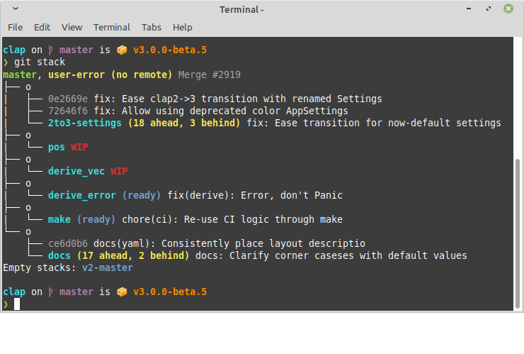

# git-stack

> **Stacked branch management for Git**



[](https://codecov.io/gh/gitext-rs/git-stack)
[][Documentation]

[](https://crates.io/crates/git-stack)

Dual-licensed under [MIT](LICENSE-MIT) or [Apache 2.0](LICENSE-APACHE)

## Documentation

- [About](#about)
- [Install](#install)
- [Getting Started](#getting-started)
- [Reference](docs/reference.md)
- [FAQ](#faq)
- [Comparison](docs/comparison.md)
- [Design](docs/design.md)
- [Contribute](CONTRIBUTING.md)
- [CHANGELOG](CHANGELOG.md)

## About

Like Stacked-Diffs? `git-stack` is [another approach](docs/comparison.md) to bringing the
[Stacked Diff workflow](https://jg.gg/2018/09/29/stacked-diffs-versus-pull-requests/)
to PRs/branches that aims to be unintrusive to a project's workflow.  Branches are the unit
of work and review in `git-stack`.  As you create branches on top of each
other (i.e. "stacked" branches), `git-stack` will takes care of all of the
micromanagement for you.

Unfamiliar with Stacked-Diffs? `git-stack` helps automate a lot of common
workflows when dealing with PRs, especially when you start to create PRs on top
of PRs.

Features:
- Upstream parent branch auto-detection
- Maintain branches relative to each other through rebase
- Defers all permanent changes until the end (e.g. HEAD, re-targeting
  branches), always leaving you in a good state
  (similar to [`git revise`](https://github.com/mystor/git-revise/))
- Separates out pull/push remotes for working from a fork
- On `--push`, detects which branches are "ready" (e.g. root of stack, no WIP)
- Undo support: backs up branch state prior to rewriting history

Non-features
- Conflict resolution: `git-stack` will give up and you'll have to use
  `git rebase` yourself to resolve the conflict.

To see how `git-stack` compares to other stacked git tools, see the [Comparison](docs/comparison.md).

## Example

From your feature branch, run:
```console
jira-3423423 $ git stack --pull
```

`git stack --pull`:
1. Auto-detects your parent remote branch (e.g. `main`).
2. Performs a `git pull --rebase <remote> <parent>`
3. Rebases `jira-3423423` (and any dev branches on the stack) onto `<parent>`
4. Shows the stacked branches

See [Getting Start](#using) for a complete workflow example.

The closest equivalent is:
```bash
jira-3423 $ git checkout main
main $ git pull --rebase upstream main
main $ git checkout jira-3154
jira-3154 $ git rebase HEAD~~ --onto main
jira-3154 $ git checkout jira-3259
jira-3259 $ git rebase HEAD~ --onto jira-3154
jira-3259 $ git checkout jira-3423
jira-3423 $ git rebase HEAD~ --onto jurao-3259
jira-3423 $ git log --graph --all --oneline --decorate main..HEAD
```
*For more, see [Command Reference](docs/reference.md#commands)*

*Parent branch auto-detection works by separating  the concept of
upstream-controlled branches (called "protected branches") and your development
branches.*

## Install

[Download](https://github.com/gitext-rs/git-stack/releases) a pre-built binary
(installable via [gh-install](https://github.com/crate-ci/gh-install)).

Or use rust to install:
```console
$ cargo install git-stack
```

We also recommend installing
[`git-branch-stash`](https://github.com/gitext-rs/git-branch-stash) for easily
undoing `git stack` operations:
```console
$ cargo install git-branch-stash-cli
```

### Uninstall

See the uninstall method for your installer.

Once removed, `git-stack` leaves behind:
- `.git/branch-stash`

Removing this is safe and will have no effect.

## Getting Started

### Configuring `git-stack`

**Protected branches:** These are branches that `git-stack` should not modify.
`git-stack` will also rebase local protected branches against
their remote counter parts.  Usually you mark shared or long-lived branches as
protected, like `main`, `v3`.

Run `git-stack --protected -v` to test your config
- To locally protect additional branches, run `git-stack --protect <glob>`.
- When adopting `git-stack` as a team, you can move the protected branches from
  `$REPO/.git/config` to `$REPO/.gitconfig` and commit it.

**Pull remote** when working from a fork, where upstream is a different remote than
`origin`, run `git config --add stack.pull-remote <REMOTE>` to set your remote in `$REPO/.git/config`.

To see the config, run `git-stack --dump-config -`.

For more, see [Configuration Reference](docs/reference.md#configuration).

### Using

```console
$ # Update branches against upstream
$ git stack --pull

$ # Start a new branch / PR
$ git switch -c feature1
$ git add -A; git commit -m "Work"
$ git add -A; git commit -m "More Work"
$ git add -A; git commit --fixup HEAD~~

$ # See what this looks like
$ git stack

$ # Clean up in preparation for a push
$ git stack --pull
$ git stack --fixup squash

$ # Push whats ready
$ git stack --push
```

For more, see [Command Reference](docs/reference.md#commands).

## FAQ

### When should my branches be stacked?

This is up to you.  Some might prefer to have linear development (single branch) and just manipulate ordering within that.

For me, I prefer to stack branches of related work or when there is a
dependency between them, like a feature being stacked on top of a refactor to
enable that feature
- Only deal with conflicts when I have to (one gets merged we're rebasing on top of it)
- Stacking of PRs, especially of unrelated work, doesn't work too well in Github

### How do I stack another branch on top of an existing one?

- New branch: `git switch feature1 && git switch -c feature2` and start adding commits
- Moving existing: `git stack --rebase --base feature1 --onto main` moves `feature2` to `main`, from off of `feature1`
  - Without `git stack`: `git rebase feature1 --onto main`

### How do I start a new feature?

This works like normal, just checkout the branch you want to base the feature on and start adding commits.

For example:
```console
$ git switch feature1
$ git switch -c feature2
```

### How do I add a commit to a parent branch in a stack?

- If this is for fixing a problem in a previous commit,
  [`git commit --fixup <ref>`](https://git-scm.com/docs/git-commit#Documentation/git-commit.txt---fixupamendrewordltcommitgt)
  and then `git-stack --rebase` will move it to where it needs to be.
- If this is to append to the parent branch, for now you'll have to use `git rebase -i`

### How do I stack my PRs in Github?

Currently, Github is limited to showing all commits for a branch, even if some
of those commits are "owned" by another PR.  We recommend only posting one PR
at a time within a stack.  If you really need to, you can direct your reviewers
to the commits within each PR to look at.  However, you will see the CI run
status of top commit for each PR dependency.

### When is a commit considered WIP?

If a commit summary is only `WIP` or is prefixed by:
- `WIP:`
- `draft:`
- `Draft:`
- `wip `
- `WIP `

*This includes the prefixes used by [Gitlab](https://docs.gitlab.com/ee/user/project/merge_requests/drafts.html)*

### What is `git branch-staash`

[`git-branch-stash`](https://github.com/gitext-rs/git-branch-stash) is a
separate utility that is like `git stash` for instead of your working tree, it
stashes what commit each of your branches points to.  `git stack` backs up
using `git branch-stash`s file format to lower the risk of trying things out
with `git stack`.

### Why don't you just ...?

Have an idea, we'd love to [hear it](https://github.com/gitext-rs/git-stack/discussions)!
There are probably `git` operations or workflows we haven't heard of and would
welcome the opportunity to learn more.

[Crates.io]: https://crates.io/crates/git-stack
[Documentation]: https://docs.rs/git-stack
